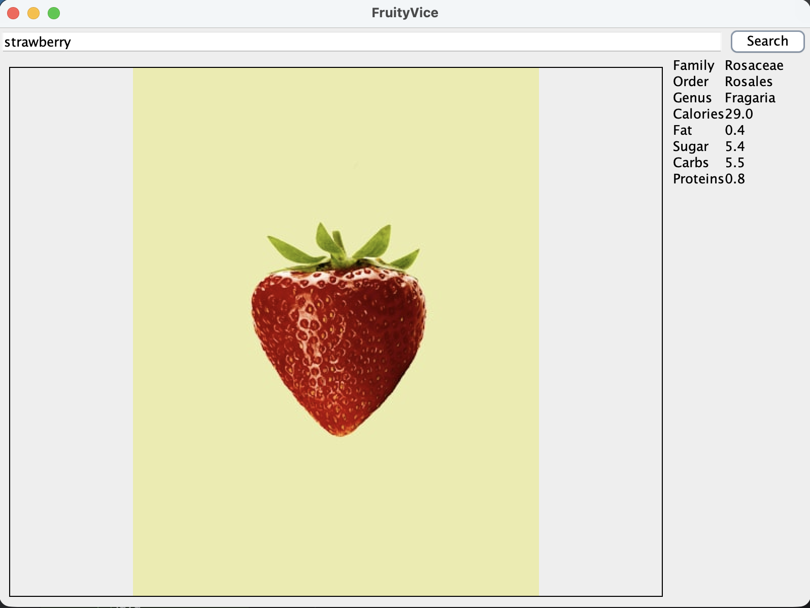

### Bensadon Fruity Vice

This project is a Java Swing program that lets you search for fruits and see their information.
You can type in a fruit name and it will display details like family, order, genus, calories, fat, sugar, carbs, and protein.
It also uses the Unsplash API to display an image of the fruit based on the search.
The UI updates using a controller and uses APIs to get real data.

### Screenshots

#### Links

#### Links

- [FruityVice API](https://www.fruityvice.com/)
- [Unsplash API](https://unsplash.com/developers)
- [Retrofit](https://square.github.io/retrofit/)
- [RxJava](https://github.com/ReactiveX/RxJava)
- [GridBagLayout](https://docs.oracle.com/javase/tutorial/uiswing/layout/gridbag.html)